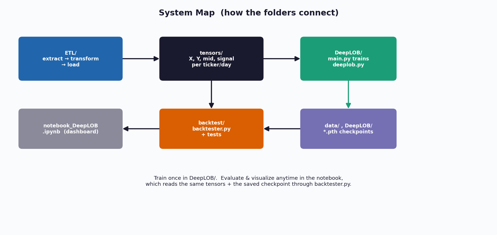
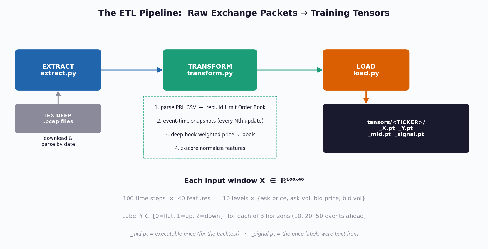
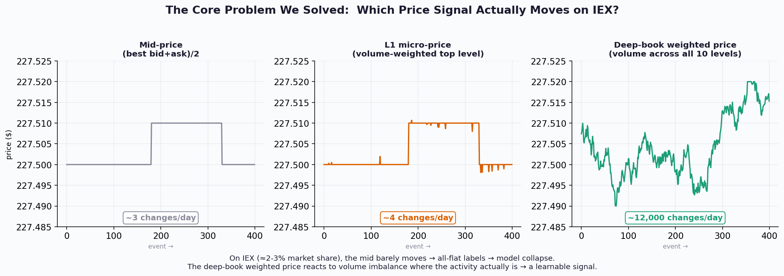
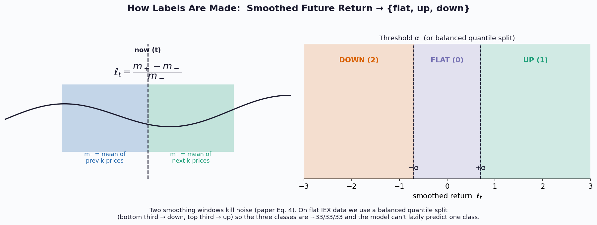
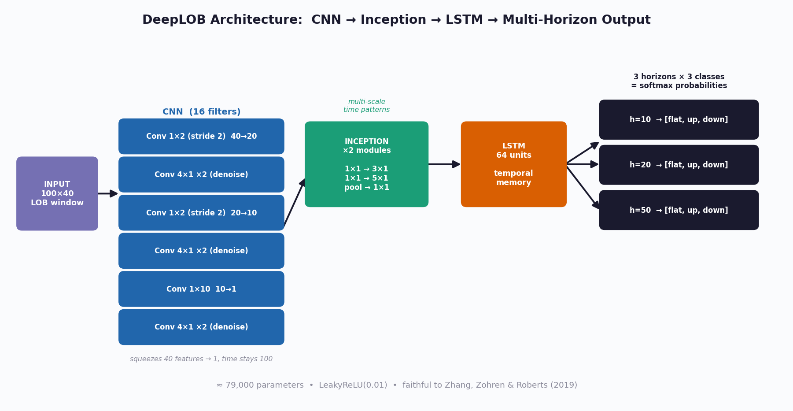
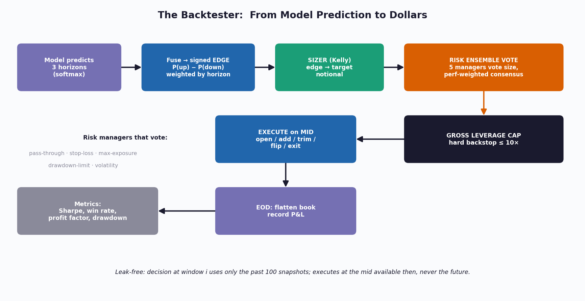

# KAIROS — DeepLOB Limit-Order-Book Price-Movement Prediction

> A deep-learning trading research stack that ingests raw exchange packets, learns to predict short-horizon price direction from the limit order book, and tests whether those predictions are tradeable — end to end, with an emphasis on **honest evaluation over flattering numbers**.

This project reimplements and adapts **DeepLOB** (Zhang, Zohren & Roberts, *Deep Convolutional Neural Networks for Limit Order Books*, 2019) for live **IEX DEEP** market data, and wraps it in a full ETL → train → backtest → visualize pipeline.

---

## Table of Contents

1. [The Idea in 60 Seconds](#1-the-idea-in-60-seconds)
2. [The Intuition: Why the Order Book Predicts Price](#2-the-intuition-why-the-order-book-predicts-price)
3. [System Map](#3-system-map)
4. [The ETL Pipeline](#4-the-etl-pipeline)
5. [The Hard Problem We Solved: Flat IEX Data](#5-the-hard-problem-we-solved-flat-iex-data)
6. [Labeling: Turning Prices into {up, flat, down}](#6-labeling-turning-prices-into-up-flat-down)
7. [The Model Architecture](#7-the-model-architecture)
8. [Training](#8-training)
9. [The Backtester](#9-the-backtester)
10. [The Results Dashboard](#10-the-results-dashboard)
11. [Directory Reference](#11-directory-reference)
12. [How to Run It](#12-how-to-run-it)
13. [Honest Caveats](#13-honest-caveats)
14. [References](#14-references)

---

## 1. The Idea in 60 Seconds

A **limit order book (LOB)** is the live ledger of every resting buy and sell order for a stock, organized into price *levels*. It is a rich, high-frequency snapshot of supply and demand. The core hypothesis — supported by a large microstructure literature — is that the *shape and evolution* of the order book contains short-term predictive information about where the price is about to go.

DeepLOB learns that mapping directly from raw order-book data with **no hand-crafted features**:

- **Convolutional layers** read the spatial structure of the book (prices vs volumes across levels).
- An **Inception module** captures patterns over multiple time scales at once.
- An **LSTM** models how those patterns evolve through time.
- The output is a probability over `{down, flat, up}` at several future horizons.

We then **simulate trading** on those predictions to answer the only question that matters for a strategy: *does acting on this signal make money?*

---

## 2. The Intuition: Why the Order Book Predicts Price

Imagine the bid side (buyers) and ask side (sellers) as two crowds pushing against a turnstile (the current price).

- If there is **far more volume resting on the bid** than the ask, buyers are "leaning" harder — the next move is more likely **up**. This is **order-book imbalance**, and it is one of the strongest known short-horizon predictors of price.
- The **micro-price** formalizes this: it is the mid-price pulled toward whichever side has *less* volume (because that side will fill first).

  $$p_{\text{micro}} = \frac{V_{\text{bid}}\, p_{\text{ask}} + V_{\text{ask}}\, p_{\text{bid}}}{V_{\text{bid}} + V_{\text{ask}}}$$

- Deeper levels matter too: large orders sitting a few ticks away act like walls that prices bounce off or break through.

DeepLOB's convolutions are essentially **learnable imbalance detectors** across all 10 levels and across time — found by gradient descent rather than hand-tuned.

---

## 3. System Map

The repository is organized so each stage is independent and reusable. Train once; evaluate and visualize as often as you like.



| Folder | Role |
|--------|------|
| `src/ETL/` | Download → parse → rebuild book → snapshot → label → save tensors |
| `src/tensors/` | The training data (`_X`, `_Y`, `_mid`, `_signal` per ticker/day) |
| `src/DeepLOB/` | Model definition (`deeplob.py`) and training loop (`main.py`) |
| `data/`, `src/DeepLOB/*.pth` | Saved model checkpoints |
| `src/backtest/` | The trading simulator (`backtester.py`) + its test suite |
| `notebook_DeepLOB.ipynb` | The visual results dashboard |
| `papers/` | Source papers (DeepLOB, ensembles, HFT) |
| `compute/` | C++ helpers for heavy data work |

---

## 4. The ETL Pipeline

Raw market data arrives as **IEX DEEP `.pcap`** packet captures. Turning that into clean training tensors is most of the engineering work.



**Extract** (`extract.py`) downloads and parses packets by date into per-day CSVs of price-level updates (PRL).

**Transform** (`transform.py`) does the heavy lifting:

1. **Rebuild the limit order book.** Replay every update tick-by-tick. A size of `0` means *remove this level* — a subtle but critical rule; dropping those messages leaves stale prices and corrupts the book.
2. **Snapshot in event-time.** Instead of one snapshot per clock-second (which on a sparse feed produces thousands of identical copies), take one snapshot every *N* book updates. Every row then carries genuinely new information.
3. **Build the label signal** (see §5–§6).
4. **Normalize.** Z-score each feature so prices and volumes live on comparable scales.

**Load** (`load.py`) writes four tensors per ticker/day:

| File | Shape | Purpose |
|------|-------|---------|
| `_X.pt` | `(N, 100, 40)` | model inputs: 100 time steps × 40 features |
| `_Y.pt` | `(N, 3)` | labels for horizons 10/20/50 |
| `_mid.pt` | `(T,)` | executable mid-price (used by the backtester) |
| `_signal.pt`| `(T,)` | the price the labels were derived from |

Each input window is structured exactly as in the paper:

$$X = [x_1, \dots, x_{100}]^\top \in \mathbb{R}^{100\times 40}, \qquad x_t = \{p_a^{(i)}, v_a^{(i)}, p_b^{(i)}, v_b^{(i)}\}_{i=1}^{10}$$

---

## 5. The Hard Problem We Solved: Flat IEX Data

This is the most important section for understanding why this project looks different from the textbook DeepLOB.

The paper used **London Stock Exchange** data — ~150,000 events per stock per day, with the mid-price moving constantly. **IEX has only ~2–3% of US market share**, so for mega-caps like AAPL and NVDA the *best bid/ask barely changes all day*. We measured **as few as 2–3 mid-price changes across an entire trading session.**

A label built on a price that never moves is **always "flat."** Feed a model 99.9% flat labels and it learns the only rational response: *always predict flat.* Accuracy looks fine (it's right 99% of the time) but the model is useless and every prediction is the same class.

We tested three candidate price signals on the same data:



- **Mid-price** — frozen. ~3 changes/day. Unusable.
- **L1 micro-price** — slightly better, but on IEX the *top-level* volume is also nearly static. ~4 changes/day. Still unusable.
- **Deep-book volume-weighted price** — weights the best bid/ask by **total volume across all 10 levels**. This reacts to the deep-level churn where the hundreds of thousands of daily IEX events *actually happen*. **~12,000 changes/day** → a genuinely learnable signal.

$$p_{\text{signal}} = \frac{V_{\text{bid}}^{(1..10)}\, p_{\text{ask}}^{(1)} + V_{\text{ask}}^{(1..10)}\, p_{\text{bid}}^{(1)}}{V_{\text{bid}}^{(1..10)} + V_{\text{ask}}^{(1..10)}}$$

This is grounded in the paper's own claim that order-book imbalance is a strong predictor — we simply extend imbalance from one level to all ten because that is where IEX's information lives.

> **The honest trade-off:** the model now predicts the direction of the *book-pressure-weighted price*, not the raw NBBO mid. On IEX that is the only target with enough movement to learn from. With full-market data (e.g. NASDAQ ITCH) you would switch back to the mid.

---

## 6. Labeling: Turning Prices into {up, flat, down}

We never compare a single instant to a single future instant — that is far too noisy. Following the paper (Eq. 4), we compare **smoothed** windows of past and future prices.



$$m_-(t) = \frac{1}{k}\sum_{i=0}^{k} p_{t-i}, \qquad m_+(t) = \frac{1}{k}\sum_{i=1}^{k} p_{t+i}, \qquad \ell_t = \frac{m_+(t) - m_-(t)}{m_-(t)}$$

Then threshold the smoothed return $\ell_t$:

$$\text{label} = \begin{cases} \text{up (1)} & \ell_t > \alpha \\ \text{down (2)} & \ell_t < -\alpha \\ \text{flat (0)} & \text{otherwise} \end{cases}$$

**On sparse data, even this collapses to all-flat under a fixed threshold.** So we default to a **balanced quantile split**: rank all returns per horizon, label the bottom third *down*, the top third *up*, the middle third *flat*. This guarantees ~33/33/33 classes by construction, so the model is forced to actually discriminate rather than lazily predicting the majority class. (Threshold mode remains available for dense data.)

---

## 7. The Model Architecture

A faithful PyTorch reimplementation of the paper's network (~79k parameters).



**Phase 1 — CNN (16 filters, 9 conv layers in 3 groups).**
The first `1×2` stride-2 convolution combines `{price, volume}` at each level into a micro-price-like feature. A second strided conv combines adjacent levels. A final `1×10` conv collapses all levels into one. Interleaved `4×1` convolutions act as **FIR denoising filters** over time. Crucially, padding keeps the time dimension at 100 throughout — *where* a pattern occurs in time matters, so no pooling is used here.

**Phase 2 — Inception (×2).**
Parallel `3×1` and `5×1` convolutions (each behind a `1×1` bottleneck) plus a pooling path, concatenated. This captures dynamics at **multiple time scales simultaneously** — like using several moving-average windows at once, but with the weights learned.

**Phase 3 — LSTM (64 units).**
Replaces a giant fully-connected layer. It models temporal dependencies in the extracted features with ~10× fewer parameters, reducing overfitting.

**Phase 4 — Multi-horizon head.**
A single linear layer outputs `3 horizons × 3 classes`, giving softmax probabilities for `{down, flat, up}` at 10, 20, and 50 events ahead.

---

## 8. Training

`src/DeepLOB/main.py` handles training:

- **Chronological splits** — train on earlier days, validate and test on *later, unseen* days. No shuffling across the time boundary (that would leak the future).
- **Class-weighted cross-entropy** — inverse-frequency weights so residual imbalance can't push the model back toward a lazy majority predictor.
- **Multi-task loss** — the three horizons are summed; the model learns all of them jointly.
- **Adam + gradient clipping** — stable optimization; clipping guards against exploding gradients.
- **Checkpoints** — saves `last_*.pth` every epoch and `best_*.pth` whenever validation macro-F1 improves above the collapse floor (~0.33).

> **Reading training health:** with 3 balanced classes, macro-F1 ≈ 0.33 means the model is guessing one class. Anything clearly above 0.33 — *with predictions spread across all three classes and changing between epochs* — means it is genuinely learning.

---

## 9. The Backtester

The model being accurate is necessary but not sufficient. The backtester answers *"can you trade it?"*



**Signal fusion.** The three horizons are combined into one signed **edge** in $[-1, +1]$:

$$\text{edge} = \sum_h w_h \big(P_h(\text{up}) - P_h(\text{down})\big)$$

**Sizing — Kelly on edge.** Position size scales with conviction. Fractional Kelly is the default because the softmax is *not* a calibrated probability, and full Kelly on an over-confident estimate is the fastest way to blow up.

$$\text{notional} = k \cdot |\text{edge}| \cdot \text{equity} \cdot \text{leverage}_{\max}$$

**Risk — an ensemble that votes.** Five risk managers (pass-through, stop-loss, max-exposure, drawdown-limit, volatility) each independently vote a size for every trade. We aggregate by **performance-weighted consensus**: each manager's vote is weighted by how well *its own past binding decisions* performed — using only already-closed trades, so there is **no look-ahead**. The system adapts toward whichever risk manager is actually working.

**Hard leverage cap.** On top of any vote, a book-level gross-exposure cap (default 10×) clips total notional. It is a backstop that always runs.

**Position management.** Each step the engine can **open, add** (rising conviction), **trim** (fading conviction), **flip** (opposite signal), or **exit** (no edge). All positions are **flattened at end of day** — no overnight risk.

**Leak-free by construction.** The decision at window *i* uses only the 100 past snapshots; execution happens at the mid available *then*, never the future mid the label was derived from. The test suite (`test_backtester.py`) asserts this along with P&L-sign correctness, VWAP accounting, EOD flatness, the leverage cap binding, the voting math, and "trained model beats random."

---

## 10. The Results Dashboard

`notebook_DeepLOB.ipynb` (root) is a self-explanatory visual report. Restart & Run All; it auto-finds the folders and the newest checkpoint. It answers four questions, each with a plain-English explanation and a one-line takeaway:

1. **Is it accurate?** Per-horizon accuracy vs the 33% random line; per-class breakdown; confusion matrix.
2. **Is it confident when right?** Reliability curve (accuracy vs confidence) and a confidence↔correctness correlation.
3. **Does it make money?** Equity curve, daily P&L, color-coded per-day table.
4. **How did it trade?** Action mix, win/loss counts, and a filterable trade blotter with confidence and edge on every row.

It ends with a single **scorecard** card (✅/⚠️ on every metric) you can screenshot.

---

## 11. Directory Reference

```
code/brain/
├── data/
│   └── last_deeplob_model.pth        # rolling checkpoint
├── src/
│   ├── ETL/
│   │   ├── extract.py                # download + parse pcap → CSV
│   │   ├── transform.py              # CSV → LOB → snapshots → labels → tensors
│   │   ├── load.py                   # write _X/_Y/_mid/_signal tensors
│   │   ├── main.py                   # ETL orchestrator
│   │   └── symbols.txt               # tickers to process
│   ├── DeepLOB/
│   │   ├── deeplob.py                # the model (CNN + Inception + LSTM)
│   │   ├── main.py                   # training loop, splits, checkpoints
│   │   ├── labeling.py               # labeling helpers
│   │   ├── best_deeplob_model.pth    # best checkpoint by val F1
│   │   └── report.txt                # run notes
│   ├── backtest/
│   │   ├── backtester.py             # trading simulator (sizer + risk ensemble)
│   │   └── test_backtester.py        # 20-check correctness suite
│   ├── parsed/  pcap/  tensors/      # ETL intermediates + outputs
│   ├── notebook_DeepLOB.ipynb        # visual results dashboard
│   └── tests.ipynb                   # scratch / experiments
└── compute/                          # C++ helpers (data.cpp, disruptor/)
papers/                               # source PDFs
```

---

## 12. How to Run It

**0. Environment**
```bash
python -m venv .venv && source .venv/bin/activate
pip install torch numpy pandas scikit-learn matplotlib
```

**1. Build the data (ETL)**
```bash
cd src/ETL
python main.py          # downloads, parses, builds tensors into ../tensors/
```
Watch the per-ticker log: you want to see thousands of *weighted-price changes* and a roughly **33/33/33** label split. If a day prints near-100% flat, it is skipped automatically.

**2. Train**
```bash
cd ../DeepLOB
python main.py          # trains, validates on later days, saves best_*.pth
```
Healthy training = validation macro-F1 climbing above 0.33 with predictions spread across all three classes.

**3. Backtest (numbers)**
```bash
cd ../backtest
python backtester.py    # P&L, Sharpe, win rate, drawdown
python test_backtester.py   # 20 correctness checks (should all PASS)
```

**4. Visualize (the readable report)**
Open `src/notebook_DeepLOB.ipynb` → Restart & Run All.

> **Tuning knobs** live in each file's `CONFIG`: `tickers`, `test_dates`, `every_n` (snapshot sparsity), `kelly_multiplier`, `max_gross_leverage`, and the risk-vote mode.

---

## 13. Honest Caveats

This project is built to *avoid fooling itself*. A few things to keep front of mind:

- **The signal is the deep-book weighted price, not the NBBO mid.** That is a deliberate adaptation to IEX's sparsity, not the paper's exact target. Interpret P&L accordingly.
- **P&L is realized on the executable mid.** If the mid is flat on a given day, even a good model captures little — that is the *data* talking, not the model. The dashboard says this out loud.
- **Softmax ≠ calibrated probability.** Kelly sizing is run fractional for exactly this reason. Crank it up only once you trust the edge out-of-sample.
- **Fees are zero by default.** Turn them on before believing any live-trading conclusion.
- **More data beats more tuning.** The paper used ~125 trading days; with 30 you are data-limited. The highest-value next step is simply more days, not more epochs.
- **Risk-manager voting is causal.** "Take the best" is implemented as performance-weighting on *past* trades — never as picking the best result in hindsight, which would be look-ahead bias.

---

## 14. References

- Z. Zhang, S. Zohren, S. Roberts. **DeepLOB: Deep Convolutional Neural Networks for Limit Order Books.** *IEEE Transactions on Signal Processing*, 2019. (`papers/`)
- A. Ntakaris et al. **Benchmark dataset for mid-price forecasting of limit order book data (FI-2010).** *Journal of Forecasting*, 2018.
- C. Szegedy et al. **Going Deeper with Convolutions (Inception).** CVPR, 2015.
- S. Hochreiter, J. Schmidhuber. **Long Short-Term Memory.** *Neural Computation*, 1997.
- Additional papers on ensembles and GPU-accelerated HFT are in `papers/`.

---

*Built as a research stack: the goal is a truthful answer to "is there a tradeable edge here," not an impressive-looking backtest.*
